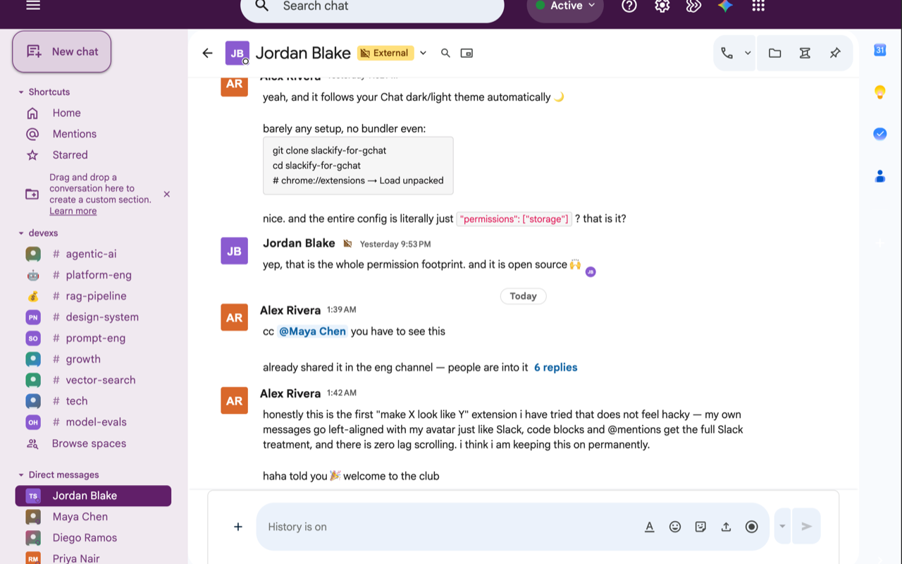
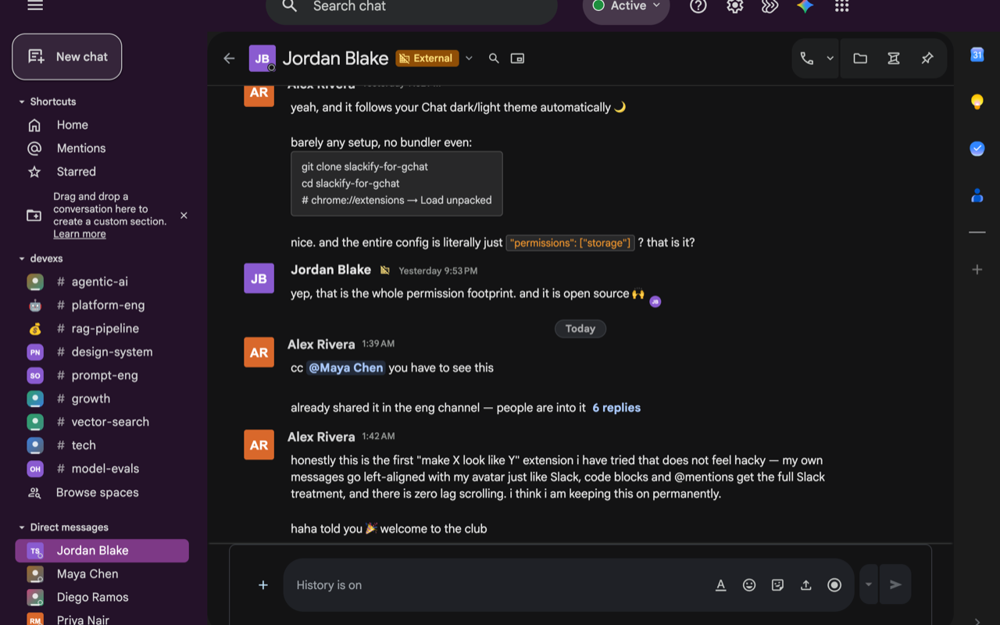
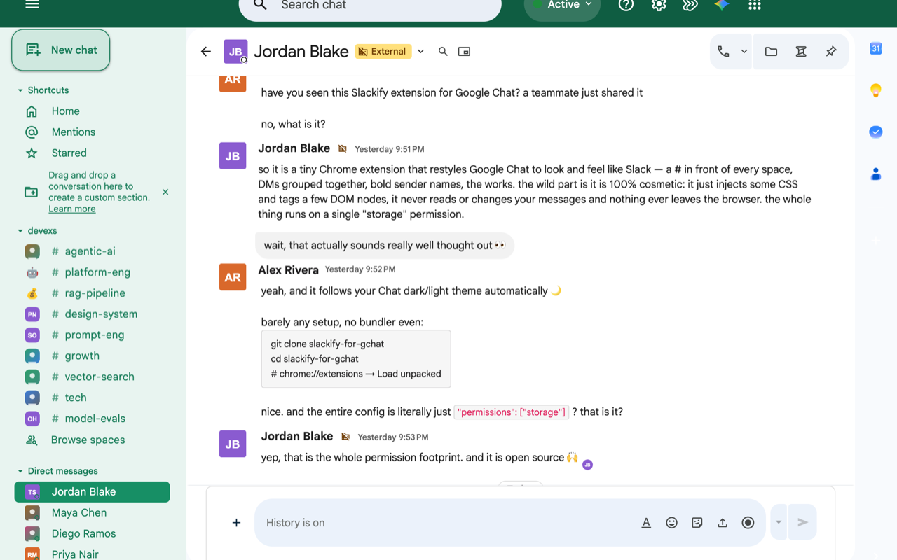
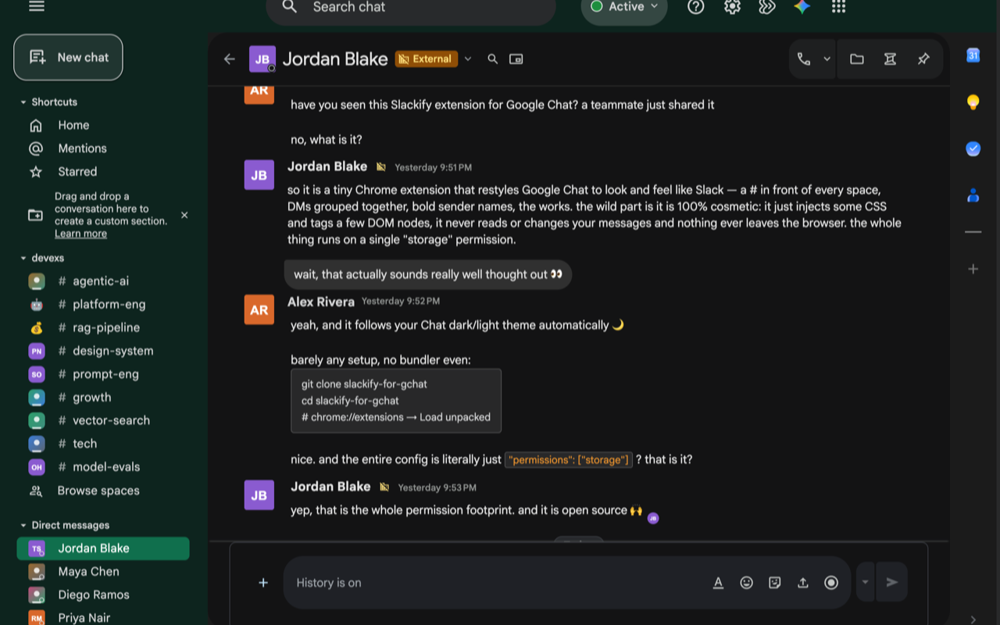
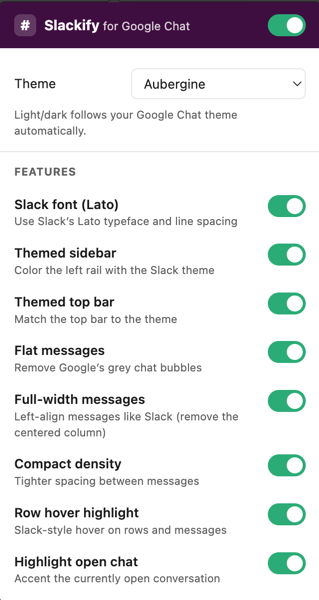

# Slackify for Google Chat

A Chrome extension that makes **Google Chat** ([chat.google.com](https://chat.google.com)) look and feel like **Slack** — themes, light/dark, and per-feature toggles — without touching any of Chat's actual functionality.

> Cosmetic only. **No data ever leaves your browser.** No network calls, no remote code, no tracking. The only permission is `storage` (to save your settings). [See privacy →](PRIVACY.md)

[](https://github.com/sujeet100/gchat-slackify/actions/workflows/ci.yml)   

## Screenshots

Real Google Chat with the extension on (names, avatars and content are anonymized stand-ins).

| Aubergine · light | Aubergine · dark |
| --- | --- |
|  |  |
| **Jade · light** | **Jade · dark** |
|  |  |

The popup — pick a theme (light/dark follows your Google Chat setting automatically) and toggle any feature:



## Features

- 🎨 **9 Slack themes** — Aubergine, Jade, Lagoon, Clementine, Banana, Barbra, Mood Indigo, Gray, Tritanopia (high contrast)
- 🌗 **Light / dark mode** for the message area (independent of the sidebar theme, exactly like Slack)
- 🎛️ **Per-feature toggles** — turn any piece on/off from the popup:
  themed sidebar, themed top bar, flat messages, full-width/left-aligned messages, compact
  density, row hover, active-conversation highlight, bold unread, Slack-style date dividers,
  reaction pills
- 🍆 Aubergine sidebar & top bar, Slack-blue active conversation, flattened message bubbles,
  Slack-style date pills on a divider line

It does **not** change threading, search, notifications, shortcuts, or huddles — only the visual
layer. A skin can deliver Slack's *look*, not its *workflow*; that's intentional and honest.

## Why this one won't rot like the others

Every previous "Slack theme for Google Chat" was abandoned for the same reason: Chat is built on
Google's **Wiz** framework and ships **auto-generated, hashed CSS class names** (`.EAOoq`,
`.pGxpHc`) that change on every build. Theme the hashes → it breaks in weeks → maintainer quits.

This extension **never targets hash classes.** It targets only **durable hooks** — ARIA `role`,
`aria-label`, semantic `data-*`, and `:has()` relationships — plus its own `data-slackify` tags:

| What | Durable selector |
| --- | --- |
| Top bar | `header[role="banner"]` |
| Search | `[role="search"]` |
| Left rail | `c-wiz:has([aria-label="List of Direct Messages"])` → fallback `c-wiz:has([role="listitem"][data-group-id])` |
| Conversation row | `[role="listitem"][data-group-id]` (DMs `^="dm/"`, spaces `^="space/"`) |
| Unread / starred | `[data-is-unread="true"]` / `[data-starred="true"]` |
| Conversation pane | `[role="main"]` |
| Message block | `c-wiz[data-topic-id]` |
| Reactions | `[data-emoji]` · Compose | `[role="textbox"]` |

Every selector chain ends with a **locale-independent fallback** (`data-group-id`, which Google
never translates) because `aria-label` text is localized. For the few elements with *no* durable
hook (the grey bubble, the centered message column, the active row, date dividers),
[`src/tagger.js`](src/tagger.js) re-derives them at runtime (computed style, max-width, or
matching the open pane's `data-group-id`) and stamps a stable `data-slackify="…"` attribute.

**All targeting lives in one file — [`src/config.js`](src/config.js).** A Google UI change is a
few-line fix there, and [`tools/health-check.js`](tools/health-check.js) tells you exactly which
hook moved.

## Architecture

```
manifest.json        MV3. permission: storage. content scripts on chat.google.com + mail.google.com/chat.
src/config.js        Source of truth: selectors (+fallbacks), feature list, defaults, helpers.
src/themes.js        Slack theme palettes (verified hex) + light/dark mode values.
src/styles.js        Compiles the stylesheet from config + themes (feature-gated, fallback-aware).
src/apply.js         Injects the sheet once; reflects prefs onto <html data-sf-*>; watches storage.
src/tagger.js        MutationObserver stamping data-slackify tags on hook-less elements.
popup/               Settings UI → chrome.storage.sync (master switch, theme, mode, features).
tools/               health-check.js (breakage radar) + SMOKE-TEST.md.
docs/                EXTENSION-BEST-PRACTICES.md + SLACK-THEMES.md.
```

**How settings flow:** the popup writes `{prefs}` to `chrome.storage.sync` → `apply.js` flips
`data-sf-*` attributes on `<html>` → the already-injected stylesheet reacts. No rebuild, no reload.

## Install (unpacked)

1. Download/clone this folder.
2. `chrome://extensions` → enable **Developer mode** (top right).
3. **Load unpacked** → select the `gchat-slackify` folder.
4. Open [chat.google.com](https://chat.google.com) (reload if already open). Click the extension
   icon to pick a theme, light/dark, and which features you want.

> Icons aren't bundled yet (see [`icons/`](icons/)). The manifest doesn't reference them, so it
> loads fine without them. Add PNGs before publishing to the Chrome Web Store.

## Security & privacy

- **Permission:** `storage` only (saves your settings). No `tabs`, `scripting`, host permissions,
  `cookies`, or `webRequest`.
- **No network**, no remote code — provably unable to exfiltrate. [Details →](SECURITY.md)
- **Reads, never transmits.** [Privacy policy →](PRIVACY.md)
- **Open source** — audit every line.

## Performance

This is a **skin** — it must add no perceptible CPU/memory cost. The design guarantees it:

- All DOM tagging runs in `requestIdleCallback` (never competes with Chat's rendering) and is
  throttled to one pass per idle slot; the `MutationObserver` only *collects* nodes.
- Every expensive scan is cached: each message is style-scanned **once** (`WeakSet`), the rail
  once, active-row by group-id. An **idle pass performs 0 `getComputedStyle` calls** (measured + tested).
- **Zero `:has()` in the injected CSS** (it's re-evaluated on every recalc and can over-match) —
  containers are resolved in JS and tagged instead.

`npm test` enforces this contract (see [`test/performance.test.js`](test/performance.test.js)),
so performance can't silently regress. The doctrine is in [CLAUDE.md](CLAUDE.md).

## Maintenance

Google updates Chat often. Because we target durable hooks, breakage is rarer and localized:

1. Run [`tools/health-check.js`](tools/health-check.js) → it names the broken hook.
2. Fix the one chain in [`src/config.js`](src/config.js).
3. Bump the version, reload.

## Contributing

PRs welcome — see [CONTRIBUTING.md](CONTRIBUTING.md) and [CLAUDE.md](CLAUDE.md). The golden rule:
**never depend on a hashed/auto-generated class**, and keep it cosmetic, permission-light, and
network-free.

## Roadmap

- [ ] `#`-prefixed channel names · narrower-sidebar option · Slack-style compose toolbar
- [ ] Bundled icons + Chrome Web Store listing
- [ ] Automated visual-regression CI
- [ ] More verified themes (sample Slack's 2022 presets live — see `docs/SLACK-THEMES.md`)

## Disclaimer

Not affiliated with, endorsed by, or sponsored by Google or Slack. "Google Chat" and "Slack" are
trademarks of their respective owners. This extension only restyles the page in your own browser.

## License

[MIT](LICENSE)
